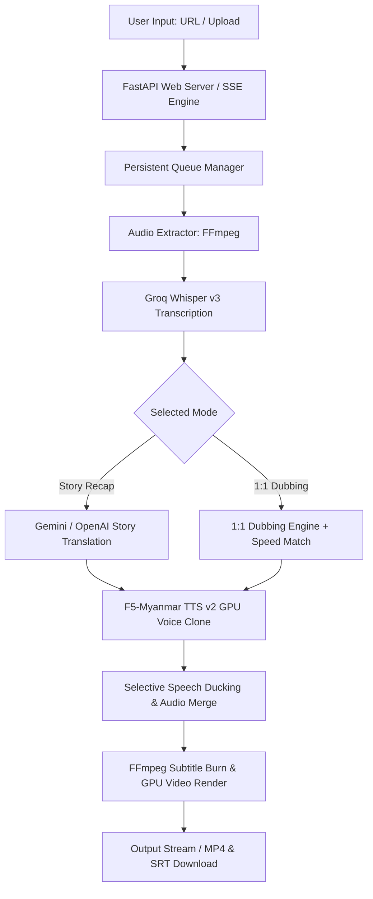

# ⚡ AutoVideo AI Studio

[](https://www.python.org/downloads/)
[](https://fastapi.tiangolo.com/)
[](LICENSE)
[](https://developer.nvidia.com/cuda-toolkit)

**AutoVideo AI Studio** is an end-to-end, GPU-accelerated video localization and story recap processing pipeline. It automatically transcribes, translates, dubs, and renders high-quality videos in Burmese (or other target languages) with state-of-the-art AI models, modern glassmorphism Web UI dashboard, persistent asynchronous queuing system, multi-tenant session isolation, and Kaggle Notebook GPU cloud integration.

---

## ✨ Key Features

### 🎬 Dual AI Processing Pipelines
* **🔥 TikTok Story Recap Mode**: Summarizes and re-tells foreign videos in an engaging, viral story recap style tailored for TikTok, Reels, and YouTube Shorts.
* **🎙️ 1:1 Video Dubbing Mode**: Direct line-by-line translation with **Dynamic Audio Speed Matching** (auto pitch-preserved time-stretching) and **Selective Vocal Ducking** (lowers original dialogue while preserving background music and audio effects).

### 🗣️ Next-Gen Burmese Voice Synthesis
* **F5-Myanmar TTS v2 Integration**: Uses zero-shot Burmese voice cloning powered by F5-TTS on GPU.
* **Custom Reference Audio Support**: Upload custom voice reference files to clone any speaker's vocal timbre.

### ⚡ Production-Grade Queue & Architecture
* **Persistent Asynchronous Task Queue**: Background job execution, retry logic, cancellation, and progress tracking saved across server restarts.
* **Multi-Key Groq API Failover**: Automatic rotation and failover across multiple Groq API keys when encountering `429 Rate Limit` errors during Whisper transcription.
* **Client Session Isolation**: Persistent client identification (`X-Client-ID`) ensuring user session privacy (User A cannot see User B's queued or completed jobs).
* **Live SSE Updates**: Server-Sent Events (SSE) provide instant, real-time UI updates without needing to manual refresh the browser.

### 🎨 Modern Glassmorphism Web Dashboard
* **Liquid Glass UI**: Styled with modern CSS glassmorphism, responsive mobile layouts, real-time progress indicators, and toast notifications.
* **Direct File Upload & URL Input**: Paste YouTube/Web video URLs or upload local `.mp4`, `.mov`, `.mkv` files directly in the dashboard.
* **Inline Streaming Preview**: Built-in HTML5 video player with HTTP Range Request support, alongside 1-click `.mp4` video and `.srt` subtitle downloads.

---

## 🏗️ Architecture Overview



---

## 🚀 Quick Start (Local Setup)

### 1. Prerequisites
* Python `3.10` or higher
* `FFmpeg` installed and added to system `PATH`
* NVIDIA GPU with CUDA support (Recommended for F5-TTS v2 voice cloning)

### 2. Installation
```bash
# Clone repository
git clone https://github.com/surviveman78-commits/autovideo.git
cd autovideo

# Install Dependencies
pip install -r requirements.txt
pip install f5-tts
```

### 3. Environment Setup (API Keys)
Create a `.env` file in the root directory or set environment variables:
```env
GROQ_API_KEY=your_groq_api_key_here
GEMINI_API_KEY=your_gemini_api_key_here
```

### 4. Running the Server
```bash
python main.py
```
Open your browser and navigate to: `http://localhost:8000`

---

## ⚡ Kaggle Notebook GPU Setup

AutoVideo AI Studio is fully optimized to run on **Kaggle GPU (T4 / P100)** environments with Cloudflare Tunnel public URLs.

1. Create a new notebook on [Kaggle](https://www.kaggle.com/).
2. Turn **GPU ON** (`GPU T4` or `P100`) and **INTERNET ON** in `Notebook Options`.
3. Open [`kaggle_notebook_cells.txt`](file:///c:/Users/Zimmimoo/Downloads/autovideo/kaggle_notebook_cells.txt) or use [`kaggle_autovideo.ipynb`](file:///c:/Users/Zimmimoo/Downloads/autovideo/kaggle_autovideo.ipynb) and copy the cell codes:
   * **Cell 1**: Environment setup & Git Clone
   * **Cell 2**: F5-Myanmar TTS v2 GPU Voice Clone installation
   * **Cell 3**: Set API Keys
   * **Cell 3.5**: Direct Video Upload / Kaggle Dataset Manager Widget
   * **Cell 4**: Launch Web Server & Public Cloudflare Tunnel URL
   * **Cell 5**: Rendered Videos Downloader

---

## 📡 API Reference Endpoint Overview

| Method | Endpoint | Description |
| :--- | :--- | :--- |
| `GET` | `/` | Serves modern Web UI Dashboard |
| `POST` | `/api/queue/add` | Adds a video URL or local file path to background processing queue |
| `GET` | `/api/queue` | Returns active, queued, completed, and failed jobs (isolated by `client_id`) |
| `POST` | `/api/queue/cancel/{job_id}` | Cancels a queued or running job |
| `POST` | `/api/queue/retry/{job_id}` | Retries a failed job |
| `POST` | `/api/upload` | Uploads local video file to server (`downloads/video/`) |
| `GET` | `/api/jobs/{job_id}/stream` | HTML5 video stream endpoint with Range Requests |
| `GET` | `/api/jobs/{job_id}/download/mp4` | Downloads rendered MP4 output file |
| `GET` | `/api/jobs/{job_id}/download/srt` | Downloads generated SRT subtitle file |

---

## 📁 Repository Structure

```
autovideo/
├── main.py                     # FastAPI application & REST/SSE endpoints
├── requirements.txt            # Python dependencies
├── kaggle_notebook_cells.txt   # Step-by-step code cells for Kaggle GPU
├── kaggle_autovideo.ipynb      # Kaggle Jupyter Notebook format
├── services/
│   ├── queue_manager.py        # Asynchronous background job queue & worker loop
│   ├── processor.py            # Video download, audio extraction & FFmpeg rendering
│   ├── translator.py           # Gemini/OpenAI story recap & 1:1 dubbing translation
│   └── tts.py                  # F5-Myanmar TTS v2 GPU voice synthesis engine
├── static/
│   ├── index.html              # Glassmorphism Web UI Dashboard
│   ├── app.js                  # Frontend logic & SSE event listeners
│   └── css/                    # Custom styling definitions
└── downloads/                  # Storage directory for videos, audio, & recap outputs
```

---

## 📄 License

This project is licensed under the MIT License - see the [LICENSE](LICENSE) file for details.
